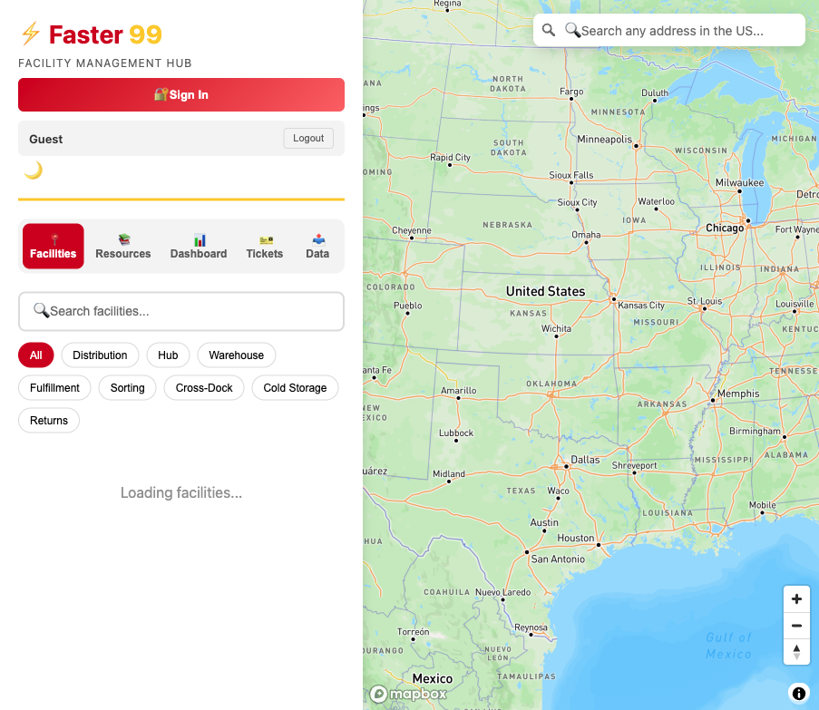
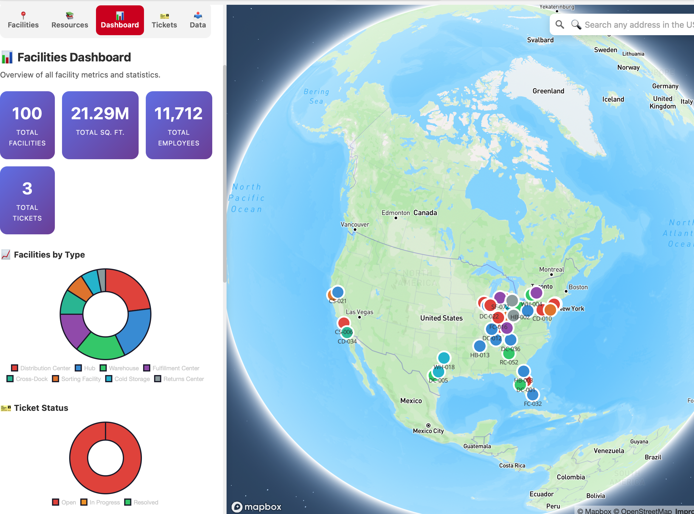
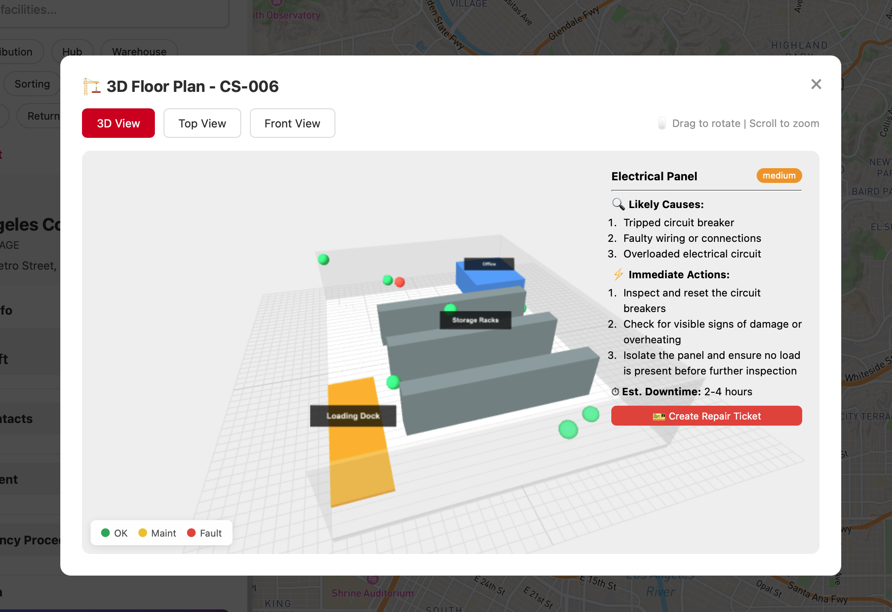
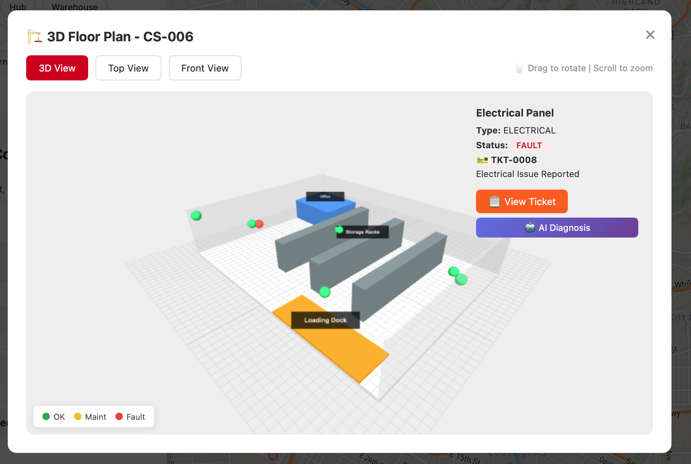
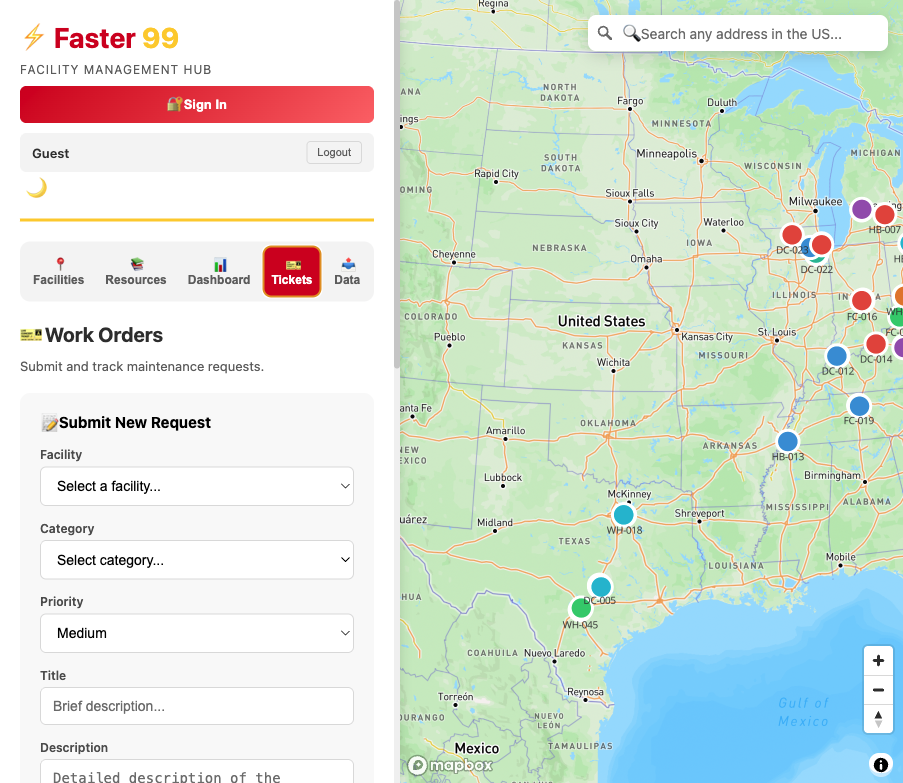
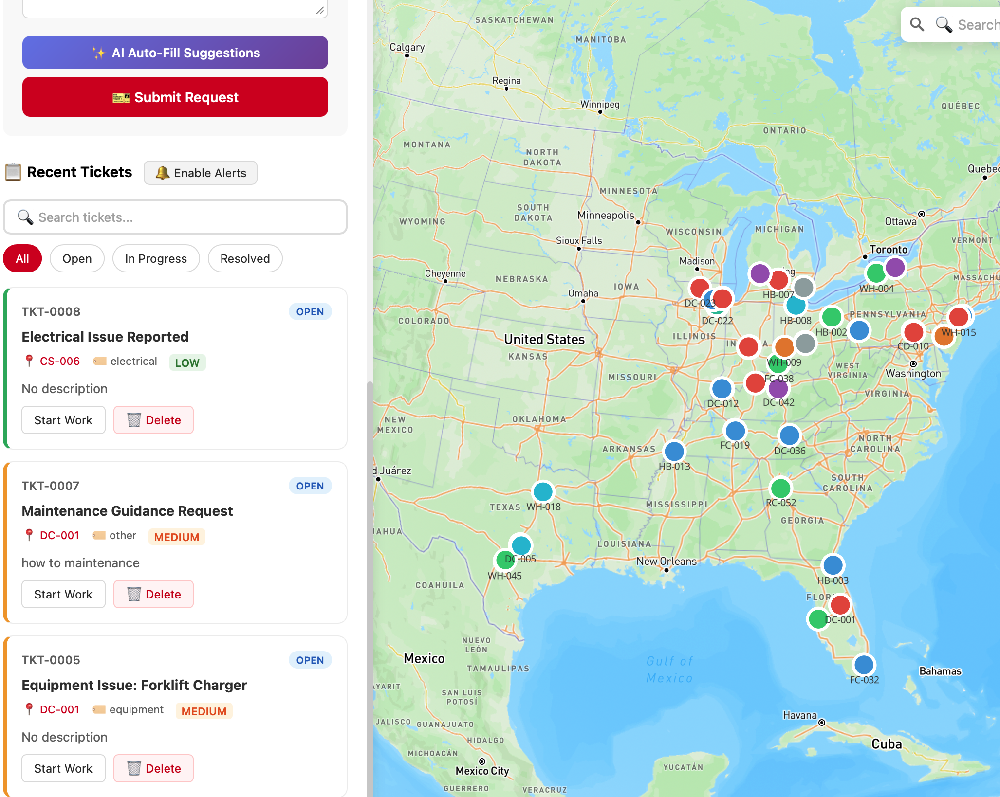
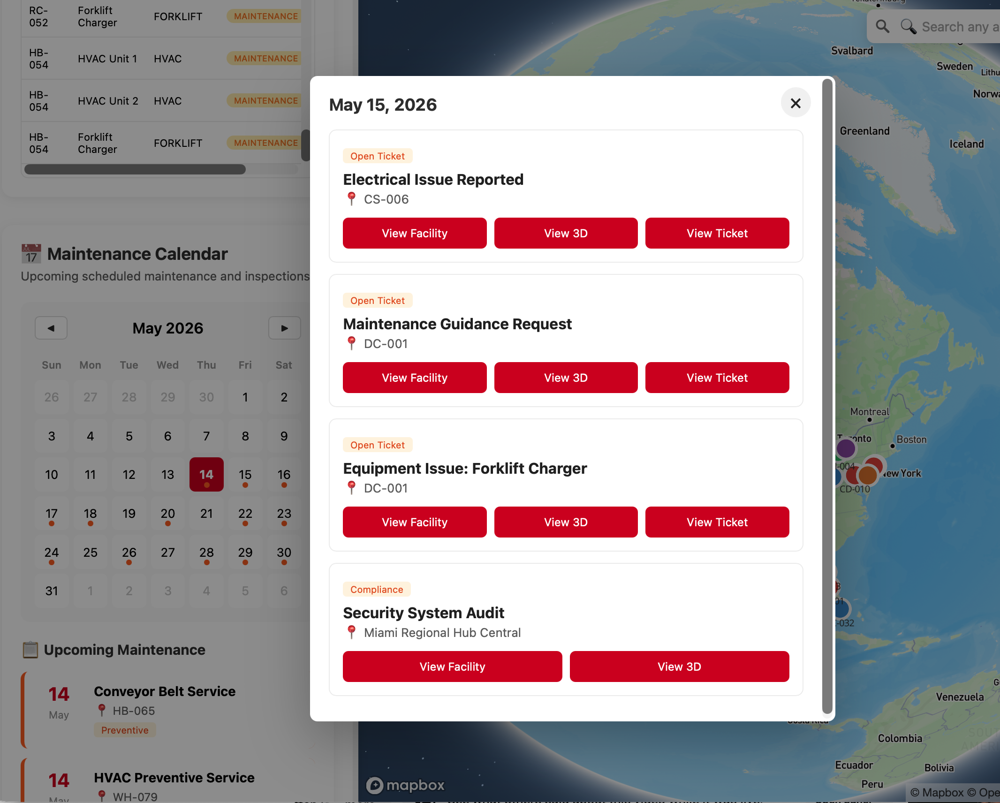
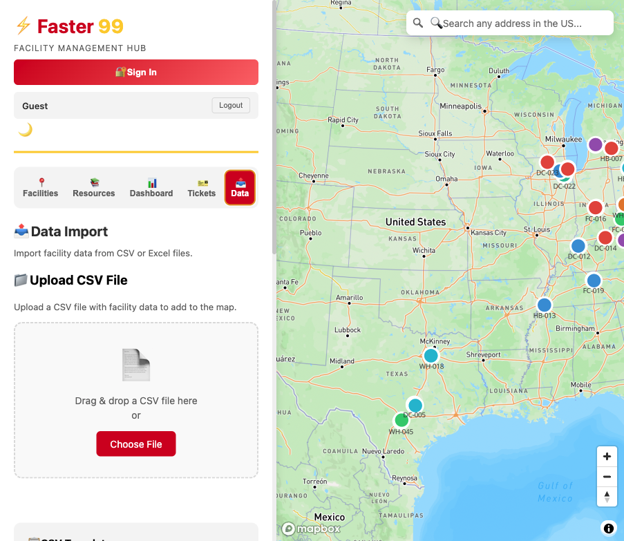

# Faster 99 - Facility Management Mapping Tool

An AI-powered facility management tool built with Mapbox GL JS, Three.js, and OpenAI — demonstrating full-stack development with Azure cloud deployment.

## Live Demo

- **Production App**: https://faster99-cbegb8b2ajdgb6b6.canadacentral-01.azurewebsites.net
- **Admin Ticket Table**: https://faster99-cbegb8b2ajdgb6b6.canadacentral-01.azurewebsites.net/admin/tickets

> App demo login: `demo@faster99.com` / `faster99demo` (or register with any email)
>
> Admin table demo passcode: `faster99admin`

**Scan to open on mobile:**


## Demo Walkthrough

Use this flow to review the full demo in 5-7 minutes:

1. **Open the production app**: Go to https://faster99-cbegb8b2ajdgb6b6.canadacentral-01.azurewebsites.net and sign in with the demo account. The Facilities tab opens with a Mapbox map of 100 facility locations across the US.

2. **Explore a facility and 3D floor plan**: Select `DC-001` or any facility card, then open the 3D floor plan. Click a non-operational equipment marker to inspect its status and run **AI Diagnosis** for likely causes, immediate actions, and estimated downtime.

3. **Create a repair ticket from diagnosis**: From the AI Diagnosis panel, click **Create Repair Ticket**. The app closes the 3D view, switches to Tickets, and auto-fills the facility, category, and title so the request can be submitted quickly.

4. **Track work orders**: In the Tickets tab, create, search, filter, start work, resolve, or delete tickets. Ticket records are persisted in Azure Database for PostgreSQL and immediately affect the 3D equipment state, dashboard counts, and inventory status.

5. **Review maintenance operations**: Open Resources and scroll to Equipment Inventory and Maintenance Calendar. Inventory status is derived from active tickets and scheduled maintenance windows. Calendar events are clickable and can navigate directly to the facility, 3D view, or related ticket.

6. **Review facility analytics**: Open Dashboard to see facility totals, square footage, employees, ticket status charts, facility type distribution, and state coverage.

7. **Inspect the admin ticket table**: Open https://faster99-cbegb8b2ajdgb6b6.canadacentral-01.azurewebsites.net/admin/tickets and enter the demo passcode `faster99admin`. The protected table shows live PostgreSQL ticket records with search, status filtering, refresh, and CSV export.

8. **Try data import/export**: Open Data to download the CSV template, review required facility columns, upload facility data, and export facility/contact records.

## Demo Screenshots

### Map and Facility Overview

| National facility map | Dashboard analytics |
| --- | --- |
|  |  |

### 3D Floor Plan and AI Diagnosis

| AI equipment diagnosis | Ticket-linked equipment status |
| --- | --- |
|  |  |

### Work Order and Maintenance Flow

| Ticket creation and AI suggestions | Recent tickets and map context |
| --- | --- |
|  |  |

| Maintenance calendar | Data import |
| --- | --- |
|  |  |

## Features

### 🤖 AI-Powered Features (OpenAI GPT-4o)
- **Smart Ticket Auto-Fill** — describe a problem in plain English, AI suggests category, priority, title, and step-by-step repair instructions
- **Operations Summary** — one-click AI summary of current facility and ticket status for daily briefings
- **Equipment Fault Diagnosis** — click any faulty 3D equipment, AI identifies likely causes, immediate actions, and estimated downtime

### 🗺️ Interactive Mapping
- Interactive map with 100 facility locations across the US
- Search and filter by facility type
- Click-to-zoom facility navigation

### 🏢 3D Facility Visualization
- Three.js powered 3D floor plans
- Interactive equipment inspection with status indicators
- Equipment status is linked to active maintenance tickets
- AI diagnosis panel for non-operational equipment
- One-click repair ticket creation from the 3D diagnosis workflow

### 🎫 Work Order Management
- Create and track maintenance tickets
- Status workflow: Open → In Progress → Resolved
- Filter and search tickets by status, title, facility, category
- Direct navigation from ticket to facility on map
- Persistent ticket storage in Azure Database for PostgreSQL
- Protected admin ticket table for reviewing database records

### 📊 Dashboard & Analytics
- Facility statistics overview (total facilities, sqft, employees, tickets)
- Chart.js donut and bar charts (facility types, ticket status, top states)
- Deterministic equipment inventory across all facilities
- Equipment status is derived from tickets and scheduled maintenance windows
- Maintenance calendar with clickable events that navigate to the facility, 3D view, or related ticket
- Data import/export (CSV)

### 📱 Mobile Responsive
- Optimized layout for iPhone and Android
- Map on top, sidebar below for easy one-hand navigation
- Scrollable tabs and touch-friendly buttons
- Tested on iPhone 11

### 🌙 Dark / Light Mode
- One-click toggle between dark and light theme
- Preference saved automatically (persists after refresh)

### 🔔 Browser Notifications
- Enable alerts with one click
- Desktop notification when a ticket is created
- Notifies when another user creates a ticket (via real-time sync)

### 🔐 Authentication & Database
- Demo login with role selection
- Persistent ticket storage in Azure Database for PostgreSQL Flexible Server
- Tickets shared across all users through the Flask API
- Role-based access (Administrator, Manager, Technician, Viewer)

### 🔧 Technical Features
- RESTful API backend with AI endpoints
- Full-stack Azure App Service deployment
- Azure PostgreSQL connection health endpoint
- CI/CD with GitHub Actions

## Tech Stack

| Layer | Technology |
|-------|-----------|
| **Frontend** | HTML5, CSS3, JavaScript |
| **Mapping** | Mapbox GL JS, GeoJSON |
| **3D Graphics** | Three.js, OrbitControls |
| **AI** | OpenAI GPT-4o-mini (ticket suggestions, diagnosis, summaries) |
| **Charts** | Chart.js (donut & bar charts) |
| **Backend** | Python, Flask, Gunicorn |
| **Database** | Azure Database for PostgreSQL Flexible Server |
| **Cloud** | Azure App Service |
| **CI/CD** | GitHub Actions |

## AI Endpoints

| Method | Endpoint | Description |
|--------|----------|-------------|
| POST | `/api/ai/ticket-suggest` | Auto-fill ticket from description |
| POST | `/api/ai/dashboard-summary` | Generate operations summary |
| POST | `/api/ai/equipment-diagnosis` | Diagnose equipment fault |
| GET | `/api/ai/debug` | Check whether the OpenAI key is configured |

## API Endpoints

| Method | Endpoint | Description |
|--------|----------|-------------|
| GET | `/` | Serve the application |
| GET | `/style.css` | Serve styles |
| GET | `/admin/tickets` | Protected admin ticket table |
| GET | `/api/health/db` | Check PostgreSQL connectivity |
| GET | `/api/facilities` | List all facilities |
| GET | `/api/facilities/<id>` | Get single facility |
| GET | `/api/facilities/stats` | Get statistics |
| GET | `/api/facilities/search?q=<query>` | Search facilities |
| POST | `/api/facilities` | Create facility |
| PUT | `/api/facilities/<id>` | Update facility |
| DELETE | `/api/facilities/<id>` | Delete facility |
| GET | `/api/tickets` | List tickets |
| POST | `/api/tickets` | Create ticket |
| GET | `/api/tickets/<id>` | Get one ticket |
| PUT | `/api/tickets/<id>` | Update ticket status/details |
| DELETE | `/api/tickets/<id>` | Delete ticket |
| GET | `/api/tickets/stats` | Ticket summary statistics |
| GET | `/api/admin/tickets` | Admin-only ticket table data |

## Local Development

### Prerequisites

- Python 3.11+
- A Mapbox account (free tier available)
- Azure Database for PostgreSQL connection details
- An OpenAI API key for AI features (optional; equipment diagnosis has a local fallback)

### Setup

1. Clone the repository:
   ```bash
   git clone https://github.com/rhulucas/dhl-fm-mapping-tool.git
   cd dhl-fm-mapping-tool
   ```

2. Create a virtual environment and install dependencies:
   ```bash
   python3 -m venv .venv
   source .venv/bin/activate
   pip install -r requirements.txt
   ```

3. Start the Flask app with PostgreSQL environment variables:
   ```bash
   export DB_HOST="your-server.postgres.database.azure.com"
   export DB_NAME="postgres"
   export DB_USER="your-admin-user"
   export DB_PASSWORD="your-password"
   export DB_PORT="5432"
   export DB_SSLMODE="require"
   export OPENAI_API_KEY="your_openai_key_optional"

   PORT=5001 python api/app.py
   ```
   App and API will be available at http://127.0.0.1:5001

4. Verify the database connection:
   ```bash
   curl http://127.0.0.1:5001/api/health/db
   ```

5. Open http://127.0.0.1:5001

> **Note:** Secrets are never stored in the repository. For Azure deployment, set `DB_HOST`, `DB_NAME`, `DB_USER`, `DB_PASSWORD`, `DB_PORT`, `DB_SSLMODE`, and optionally `OPENAI_API_KEY` under App Service → Environment Variables.

## Admin Ticket Table

The protected admin table is available at:

```text
/admin/tickets
```

It asks for an admin passcode and then displays the live `tickets` table with search, status filtering, refresh, and CSV export. The backing endpoint is `/api/admin/tickets`, which requires the `X-Admin-Passcode` request header.

Set the passcode with:

```text
ADMIN_PASSCODE=your-demo-admin-passcode
```

For local development, if `ADMIN_PASSCODE` is not set, the demo fallback passcode is `faster99admin`. For a public demo, set `ADMIN_PASSCODE` in Azure App Service environment variables.

## Azure Deployment

The repository includes a GitHub Actions workflow at `.github/workflows/main_faster99.yml`.

Deployment flow:

1. Push to `main`.
2. GitHub Actions builds a deployment package with `api/`, `wsgi.py`, `index.html`, `style.css`, and `requirements.txt`.
3. The package is deployed to the Azure Web App named `faster99`.

Required Azure App Service environment variables:

```text
DB_HOST=your-server.postgres.database.azure.com
DB_NAME=postgres
DB_USER=your-admin-user
DB_PASSWORD=your-password
DB_PORT=5432
DB_SSLMODE=require
OPENAI_API_KEY=optional-openai-key
ADMIN_PASSCODE=your-demo-admin-passcode
```

Production smoke tests:

```bash
curl https://faster99-cbegb8b2ajdgb6b6.canadacentral-01.azurewebsites.net/api/health/db
curl https://faster99-cbegb8b2ajdgb6b6.canadacentral-01.azurewebsites.net/api/tickets
```

## Developer Checks

- **Database health check**: https://faster99-cbegb8b2ajdgb6b6.canadacentral-01.azurewebsites.net/api/health/db
- **Ticket API check**: https://faster99-cbegb8b2ajdgb6b6.canadacentral-01.azurewebsites.net/api/tickets
- **Admin ticket table**: https://faster99-cbegb8b2ajdgb6b6.canadacentral-01.azurewebsites.net/admin/tickets

The health check is a deployment diagnostic endpoint. It confirms that the Flask backend can read its Azure App Service environment variables, connect to Azure PostgreSQL, create/read the `tickets` table, and report the current ticket count.

## Project Structure

```
├── api/                    # Backend API
│   ├── app.py              # Flask application (facilities + AI endpoints)
│   ├── data.json           # Facility data
│   └── requirements.txt    # Python dependencies
├── .github/workflows/      # CI/CD pipelines
├── index.html              # Frontend application
├── style.css               # Styles
├── data.json               # Local data backup
└── generate_facilities.py  # Data generation script
```

## Skills Demonstrated

- **AI Integration**: OpenAI GPT-4o API, prompt engineering, structured JSON responses
- **Frontend Development**: JavaScript, HTML5, CSS3, responsive design
- **3D Graphics**: Three.js scene creation, interactive objects, raycasting
- **Mapping**: Mapbox GL JS, GeoJSON data handling, custom markers
- **Backend Development**: Python Flask, RESTful API design
- **Cloud Deployment**: Azure App Service
- **Database Integration**: Azure PostgreSQL, environment-based connection management
- **Notifications**: Browser Notification API for real-time ticket alerts
- **DevOps**: CI/CD with GitHub Actions, automated deployments
- **UX Design**: Intuitive navigation, status workflows, 3D-linked work orders, data visualization

## License

MIT
